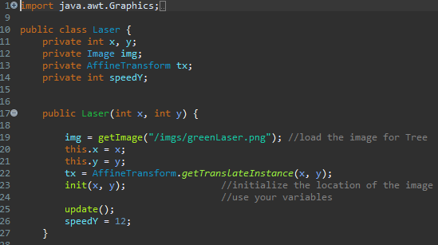
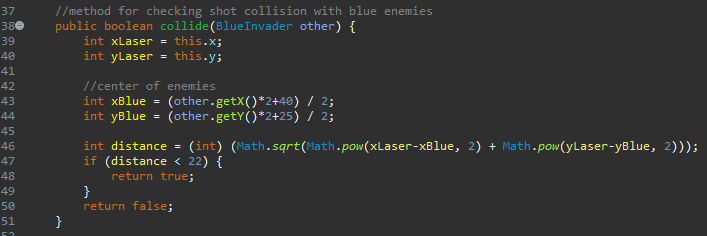
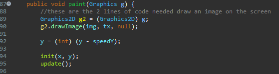

# Flappy

## Project Overview

AP CS Project: Create a game using Eclipse. 
The Directory's name is 'Flappy', but I later decided to make a simple version of Space Invaders. The original Space Invaders was a 1978 Japanese video game released by Taito, with the objective of eliminating all space invaders to win the game. I used Java to create the game code, which is the language used in AP CS. By creating Space Invaders, I practiced Java concepts I learned earlier in the year. The program is finished, but I hope to add a restart feature later. 

## Running the Project
Flappy can be run locally by cloning/forking this project. From there, run the file "Frame.java" in your local IDE.

## Game Controls
The objective of Space Invaders is to eliminate all of the enemies. The player controls the spaceship. Use the keys A and D to move left and right respectively. Use the key W to shoot the enemies. However, the enemies also shoot, and the player has 3 lives. 

## Game Code Overview
I created classes for each of the objects within the game: BlueInvaders, GreenInvaders, YellowInvaders, EnemyLasers, Lasers, Player, and Background. 

Here's a detailed overview of the Laser Class, representing the lasers shot by the player: 

Setting private variables and making Laser constructor

Checks for collisions with Blue enemies. There's similar code for yellow and green enemies. 

The paint function allows for laser movement. 

## Credits
I created this project independently in class.

